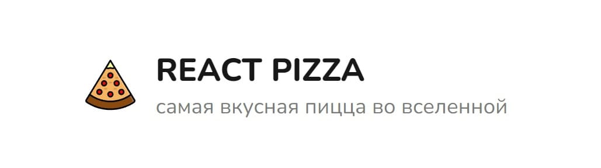
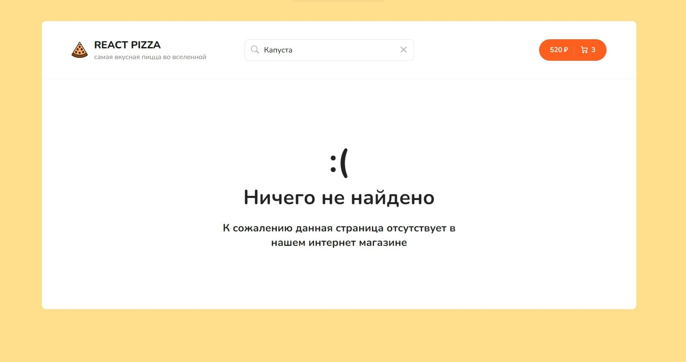

# [React-pizza](https://soft-speculoos-906fef.netlify.app)

Данный проект вы можете посмотреть по ссылке :point_right: [React-pizza](https://soft-speculoos-906fef.netlify.app)

##

Проект создается по курсу [**'React Pizza v2'**](https://www.youtube.com/watch?v=_UywBskWJ7Q&list=PL0FGkDGJQjJG9eI85xM1_iLIf6BcEdaNl) от YouTube канала [**'Archakov Blog'**](https://www.youtube.com/@ArchakovBlog) :clap:

> Описание со временем будет отредактировано и дополнено

---

## Страницы проекта

### HomePages

### ErrorPages

